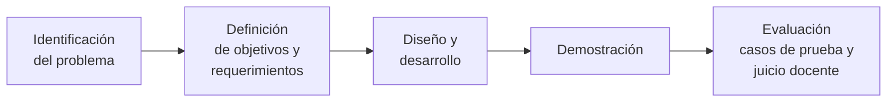
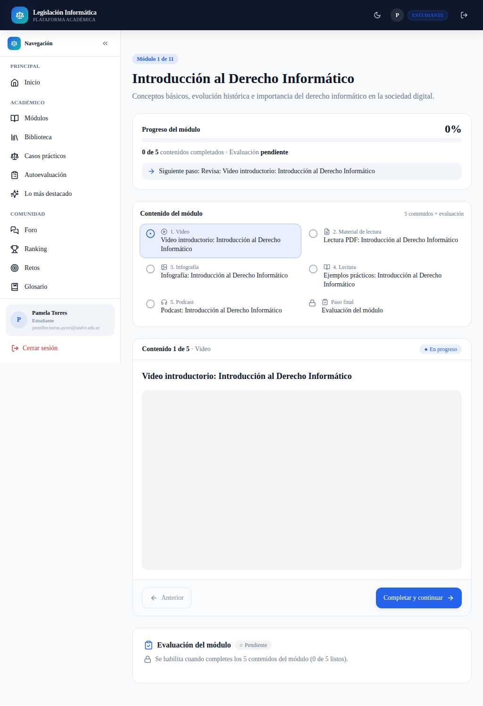
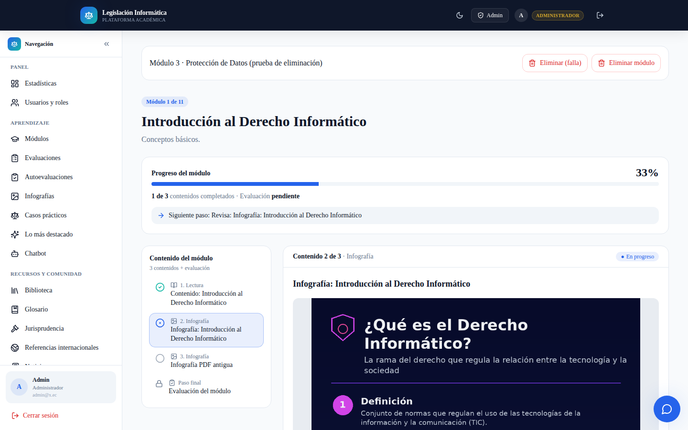
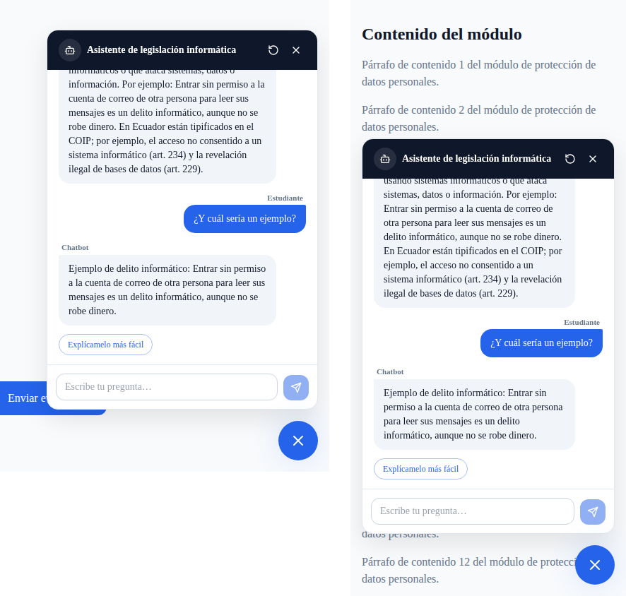
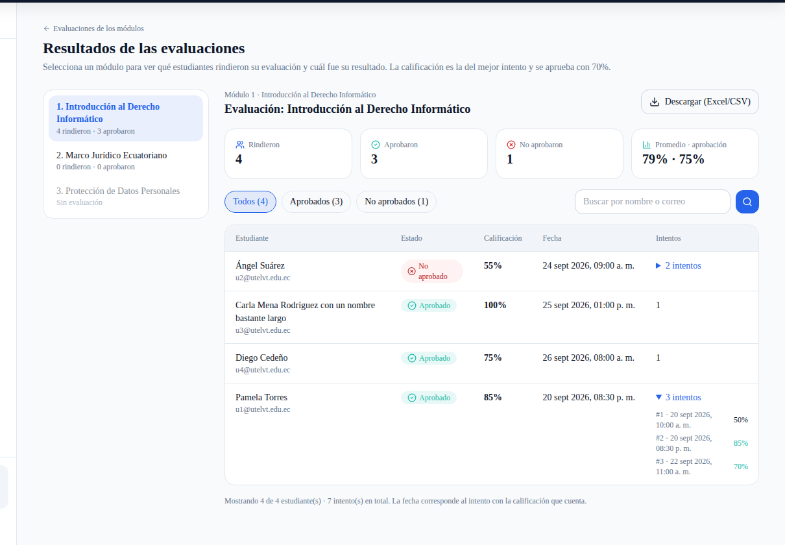
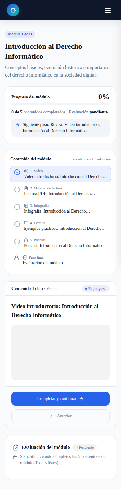
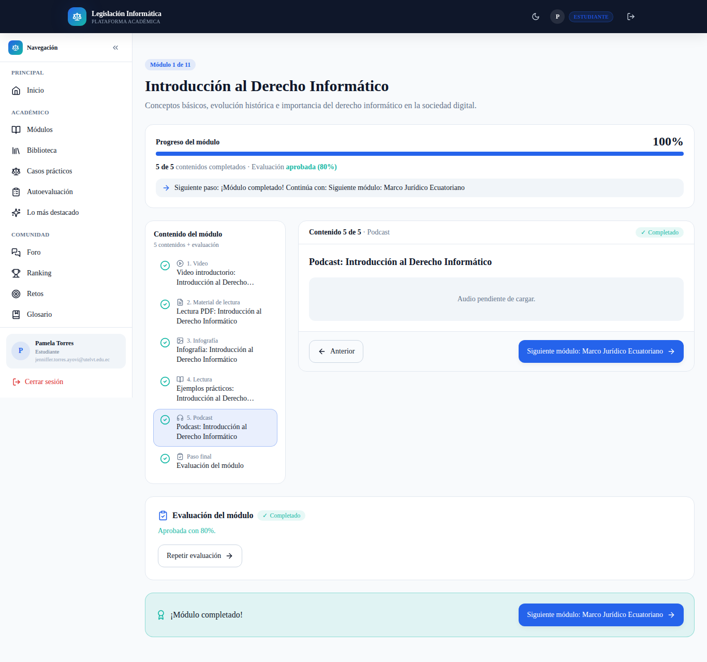
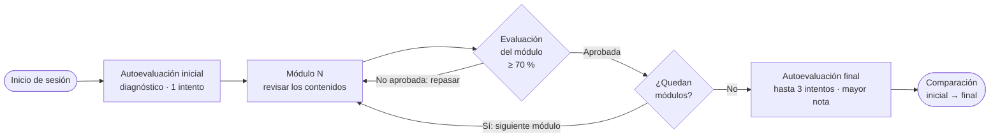
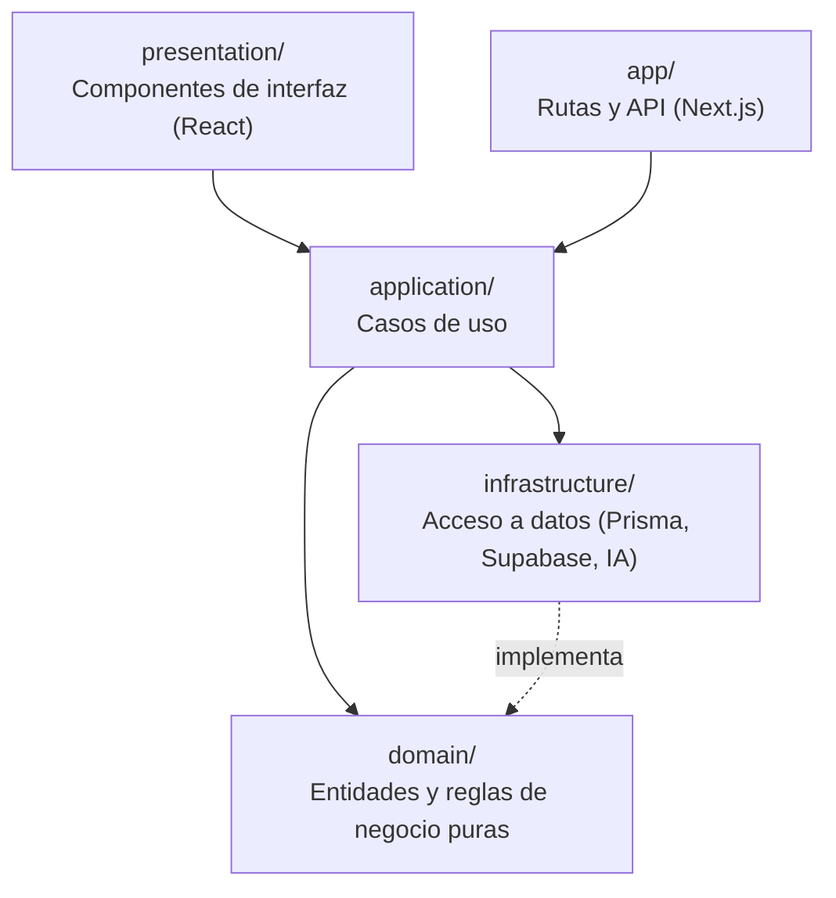

<div align="center">

# ⚖️ Plataforma de Legislación Informática

**Diseño de página web sobre legislación informática para estudiantes de la UTLVTE**

Trabajo de titulación · Universidad Técnica "Luis Vargas Torres" de Esmeraldas · 2026

Itinerario guiado por módulos · Evaluaciones · Casos prácticos · Biblioteca jurídica · Asistente virtual

[](https://nextjs.org)
[](https://www.typescriptlang.org)
[](https://www.prisma.io)
[](https://supabase.com)
[](https://vercel.com)
[](#-calidad-y-pruebas)

### [🌐 Ver la plataforma en línea](https://legislacion-informatica-vyus.vercel.app)

</div>

---

## 📑 Contenido

1. [Contexto académico](#-contexto-académico)
2. [Descripción del proyecto](#-descripción-del-proyecto)
3. [Investigación](#-investigación)
4. [Capturas de pantalla](#-capturas-de-pantalla)
5. [Funcionalidades](#-funcionalidades)
6. [Flujo de aprendizaje](#-flujo-de-aprendizaje)
7. [Arquitectura y tecnologías](#-arquitectura-y-tecnologías)
8. [Instalación y ejecución](#-instalación-y-ejecución)
9. [Calidad y pruebas](#-calidad-y-pruebas)
10. [Despliegue](#-despliegue)
11. [Documentación](#-documentación)
12. [Licencia y créditos](#-licencia-y-créditos)

---

## 🎓 Contexto académico

| | |
|---|---|
| **Título** | Diseño de página web sobre legislación informática para estudiantes de la UTLVTE |
| **Institución** | Universidad Técnica "Luis Vargas Torres" de Esmeraldas (UTLVTE) |
| **Facultad** | Facultad de Ciencias de la Ingeniería (FACI) |
| **Carrera** | Ingeniería en Tecnologías de la Información y la Comunicación |
| **Modalidad** | Trabajo de titulación, opción Proyecto de investigación |
| **Título que otorga** | Ingeniera en Tecnologías de la Información y la Comunicación |
| **Línea de investigación** | Tecnologías de la Información y la Comunicación (TIC) aplicadas al desarrollo tecnológico, innovación y transformación digital |
| **Autora** | Jenniffer Pamela Torres Ayovi |
| **Tutora** | Ing. Teresa Isabel Mina Quiñónez, MSc. |
| **Lugar y período** | Esmeraldas, Ecuador · 2025-2026 |

---

## 📌 Descripción del proyecto

Página web educativa que reúne y organiza la normativa informática ecuatoriana para facilitar su **acceso, consulta y aprendizaje** por parte de los estudiantes de la UTLVTE. Sus contenidos abarcan:

- protección de datos personales;
- delitos informáticos;
- comercio electrónico;
- propiedad intelectual;
- seguridad de la información;
- uso responsable de las tecnologías.

### Problema

En la UTLVTE, los estudiantes reciben formación específica según su carrera, pero la legislación informática **no se aborda de manera integral** para el conjunto de la comunidad estudiantil. Además, la normativa está distribuida en distintas fuentes jurídicas (Constitución, LOPDP, COIP, Ley de Comercio Electrónico, entre otras), lo que dificulta su consulta con fines educativos cuando no existe un espacio que la reúna y la organice.

### Propuesta

Un entorno digital que concentra, en un mismo lugar:

- 📚 **Módulos educativos** progresivos, con lecturas, videos, infografías y podcasts.
- 📝 **Evaluación del aprendizaje**: una evaluación por módulo y autoevaluaciones inicial y final.
- ⚖️ **Recursos de consulta**: biblioteca jurídica, glosario, casos prácticos, jurisprudencia, noticias, preguntas frecuentes y referencias internacionales.
- 🤖 **Asistente de consulta** sobre los contenidos de la plataforma.
- 🛠️ **Panel de administración**, para gestionar y actualizar los contenidos sin modificar el código.

---

## 🔬 Investigación

### Pregunta de investigación

> ¿Qué contenidos, requerimientos y funcionalidades debe integrar una página web sobre legislación informática dirigida a los estudiantes de la Universidad Técnica "Luis Vargas Torres" de Esmeraldas para organizar y facilitar la consulta de información relacionada con la normativa informática?

### Objetivo general

Diseñar una página web sobre legislación informática, mediante la identificación de requerimientos con docentes y un proceso de implementación y evaluación basado en el enfoque *Design Science Research*, con el fin de facilitar el acceso, la consulta y el aprendizaje de contenidos normativos por parte de los estudiantes de la UTLVTE.

### Objetivos específicos

1. **Determinar** los contenidos y los requerimientos funcionales y no funcionales de la página web, a partir del análisis de los fundamentos teóricos y normativos de la legislación informática y de entrevistas a docentes.
2. **Diseñar** la arquitectura, el modelo de datos y las interfaces de la página web.
3. **Implementar** la página web conforme a los requerimientos definidos, para disponer de una versión funcional accesible a los estudiantes.
4. **Evaluar** la funcionalidad y la pertinencia de la página web mediante casos de prueba y entrevistas a docentes.

### Metodología

| Aspecto | Detalle |
|---|---|
| **Enfoque y alcance** | Cualitativo · descriptivo |
| **Tipo de investigación** | Aplicada, tecnológica, documental y de campo |
| **Metodología de desarrollo** | *Design Science Research* (DSR) |
| **Participantes** | 2 docentes de la carrera de TIC (muestreo no probabilístico intencional), en la identificación de necesidades y en la valoración de pertinencia |
| **Técnicas e instrumentos** | Revisión documental · entrevista con guía de preguntas abiertas · pruebas funcionales con matriz de casos de prueba · juicio experto |

Las fases de *Design Science Research* se corresponden con la estructura del trabajo:



### Resultados

| Indicador | Resultado |
|---|---|
| Requerimientos funcionales | **32** (RF-01 a RF-32) |
| Requerimientos no funcionales | **8** |
| Casos de prueba funcionales | **31 ejecutados · 31 aprobados (100 %)** |
| Valoración de pertinencia | Realizada por los 2 docentes participantes sobre la versión implementada |

**Conclusión:** la página web reúne en un mismo entorno contenidos sobre protección de datos personales, delitos informáticos, comercio electrónico, propiedad intelectual y seguridad de la información, y constituye un recurso académico de apoyo para la consulta de la normativa informática por parte de los estudiantes.

### Alcance y limitaciones

- Es un **recurso académico** de consulta y aprendizaje. **No** es un sistema institucional oficial de la UTLVTE.
- **No** presta asesoría jurídica ni sustituye las fuentes oficiales de legislación.
- **No** contempla aplicaciones móviles. La página web es responsiva y funciona en navegadores de celular.
- La información jurídica se actualiza **desde el panel de administración**; no hay actualización automática de las leyes.

**Palabras clave:** protección de datos · seguridad de datos · propiedad intelectual · tecnología de la información · enseñanza superior · recursos educativos.

---

## 🖼️ Capturas de pantalla

<table>
  <tr>
    <td align="center" width="50%">
      <br/>
      <sub><b>Módulo de aprendizaje:</b> contenidos, progreso y siguiente paso</sub>
    </td>
    <td align="center" width="50%">
      <br/>
      <sub><b>Infografías</b> integradas en el módulo, con vista ampliada</sub>
    </td>
  </tr>
  <tr>
    <td align="center">
      <br/>
      <sub><b>Asistente virtual</b> de legislación informática</sub>
    </td>
    <td align="center">
      <br/>
      <sub><b>Panel del administrador:</b> resultados por módulo y estudiante</sub>
    </td>
  </tr>
  <tr>
    <td align="center">
      <br/>
      <sub><b>Diseño responsivo:</b> computadora, tablet y celular</sub>
    </td>
    <td align="center">
      <br/>
      <sub><b>Módulo completado</b> y acceso al siguiente</sub>
    </td>
  </tr>
</table>

---

## ✨ Funcionalidades

### 👩‍🎓 Para el estudiante

| Funcionalidad | Descripción |
|---|---|
| **Autoevaluación inicial** | Diagnóstico obligatorio de conocimientos previos (1 intento). |
| **Módulos progresivos** | Se desbloquean en orden. Cada uno muestra sus contenidos con estado ✓ completado, ● en progreso, ○ pendiente. |
| **Contenido multimedia** | Lecturas, videos, documentos PDF, podcasts e infografías ampliables. |
| **Evaluación por módulo** | Se habilita al revisar todo el contenido. Se aprueba con 70 % y puede repetirse. |
| **Autoevaluación final** | Se habilita al completar todos los módulos. Hasta 3 intentos; cuenta la mayor nota. |
| **Comparación de resultados** | Resultado inicial frente al final, para evidenciar el aprendizaje. |
| **Casos prácticos** | Situaciones reales con su análisis jurídico. |
| **Biblioteca jurídica** | Constitución, LOPDP, COIP y Ley de Comercio Electrónico, con buscador. |
| **Asistente virtual** | Resuelve dudas en lenguaje natural y usa el contexto del módulo. No resuelve evaluaciones. |
| **Recursos complementarios** | Glosario, jurisprudencia, referencias internacionales, noticias y preguntas frecuentes. |
| **Gamificación y comunidad** | Puntos de experiencia (XP), niveles, insignias, ranking, retos y foro. |

### 🛠️ Para el administrador

| Funcionalidad | Descripción |
|---|---|
| **Gestión de módulos** | Crear, editar, ordenar, activar o desactivar y eliminar. Si un módulo tiene datos de estudiantes, se archiva en lugar de borrarse. |
| **Gestión de contenidos** | Lecciones, videos e infografías con subida de imágenes. |
| **Evaluaciones** | Preguntas de 5 tipos: opción múltiple, verdadero/falso, relacionar, completar y casos. |
| **Autoevaluaciones** | Administración separada de la autoevaluación inicial y la final. |
| **Resultados** | Por módulo y estudiante: aprobados, no aprobados, calificación, fecha e intentos. Exportables a Excel. |
| **Asistente virtual** | Activación, contenidos que puede usar y estadísticas de uso, sin guardar el texto de las conversaciones. |
| **Contenido general** | Biblioteca, glosario, casos prácticos, "Lo más destacado", noticias y preguntas frecuentes. |
| **Usuarios y auditoría** | Gestión de roles, estadísticas generales y registro de acciones. |

---

## 🧭 Flujo de aprendizaje

El sistema controla automáticamente cada etapa. El estudiante no puede saltarse pasos, ni siquiera escribiendo una dirección directamente o llamando a la API del servidor.



---

## 🏗️ Arquitectura y tecnologías

### Stack tecnológico

| Capa | Tecnología |
|---|---|
| **Framework** | Next.js 14 (App Router, renderizado en servidor) |
| **Lenguaje** | TypeScript |
| **Interfaz** | React 18 · Tailwind CSS · lucide-react · Recharts |
| **Autenticación** | Supabase Auth: registro con acceso inmediato (sin confirmación por correo), recuperación de contraseña y control de acceso por roles |
| **Base de datos** | PostgreSQL (Supabase) con Prisma ORM |
| **Almacenamiento** | Supabase Storage (imágenes de infografías) |
| **Asistente virtual** | Google Gemini o Anthropic Claude (opcional), con modo básico sin IA |
| **Pruebas** | Vitest (unitarias) · Playwright (verificación en navegador durante el desarrollo) |
| **Despliegue** | Vercel |

### Arquitectura modular por capas

Cada funcionalidad (cursos, evaluaciones, chatbot, etc.) es un módulo independiente organizado en cuatro capas. Así las **reglas de negocio** quedan separadas de la base de datos y de la interfaz, y pueden probarse de forma aislada.



### Estructura del repositorio

```
├── apps/
│   └── web/                    # Aplicación Next.js
│       ├── src/
│       │   ├── app/            # Rutas: (public), (auth), (dashboard) y api/
│       │   ├── modules/        # 22 módulos por dominio:
│       │   │                   #   domain/ · application/ · infrastructure/ · presentation/
│       │   ├── components/     # Componentes de interfaz compartidos
│       │   └── lib/            # Utilidades: Prisma, Supabase, autorización, flujo de aprendizaje
│       ├── prisma/             # Esquema (31 modelos) y datos iniciales
│       └── public/             # Imágenes e infografías
├── docs/                       # Manuales, decisiones de diseño y capturas
└── *.bat                       # Scripts de ayuda para Windows
```

---

## 🚀 Instalación y ejecución

### Requisitos

- [Node.js](https://nodejs.org) 20 o superior
- Una cuenta de [Supabase](https://supabase.com) (el plan gratuito es suficiente)

### Pasos

```bash
# 1. Instalar dependencias
cd apps/web
npm install

# 2. Configurar las variables de entorno
cp .env.example .env.local      # completar con las credenciales de Supabase

# 3. Crear la base de datos y cargar los contenidos iniciales
npx prisma migrate dev
npm run prisma:seed

# 4. Iniciar el servidor de desarrollo
npm run dev
```

La plataforma queda disponible en **http://localhost:3000**.

> 💡 **En Windows** puedes usar los scripts de la raíz: `INSTALAR.bat`, `CONFIGURAR-BASE-DATOS.bat`, `INICIAR.bat`, `VER-BASE-DATOS.bat` y `VERIFICAR-CALIDAD.bat`.

### Variables de entorno

| Variable | Obligatoria | Descripción |
|---|:---:|---|
| `NEXT_PUBLIC_SUPABASE_URL` | ✅ | URL del proyecto de Supabase |
| `NEXT_PUBLIC_SUPABASE_ANON_KEY` | ✅ | Clave pública de Supabase |
| `SUPABASE_SERVICE_ROLE_KEY` | ✅ | Clave de servicio (gestión de usuarios y subida de imágenes) |
| `DATABASE_URL` | ✅ | Conexión a PostgreSQL (pooler) |
| `DIRECT_URL` | ✅ | Conexión directa a PostgreSQL (migraciones) |
| `NEXT_PUBLIC_SITE_URL` | ✅ | URL pública del sitio |
| `GEMINI_API_KEY` | — | Activa el asistente con Google Gemini |
| `ANTHROPIC_API_KEY` | — | Alternativa: asistente con Anthropic Claude |
| `GEMINI_MODEL` · `CHATBOT_MODEL` · `CHATBOT_PROVIDER` | — | Ajustes opcionales del asistente |

> 🔒 Las claves privadas solo se usan en el servidor y **nunca deben subirse al repositorio**: `.env.local` está excluido en `.gitignore`.

### Scripts disponibles (en `apps/web`)

| Script | Descripción |
|---|---|
| `npm run dev` | Servidor de desarrollo |
| `npm run build` · `npm run start` | Compilación y servidor de producción |
| `npm run lint` | Análisis de código, con reglas de accesibilidad (`jsx-a11y`) |
| `npm run typecheck` | Verificación de tipos de TypeScript |
| `npm run test` | Pruebas unitarias |
| `npm run test:coverage` | Pruebas con reporte de cobertura |
| `npm run prisma:migrate` · `npm run prisma:seed` | Migraciones y datos iniciales |

---

## ✅ Calidad y pruebas

| Aspecto | Práctica aplicada |
|---|---|
| **Pruebas unitarias** | 174 pruebas en 26 archivos sobre las reglas de negocio: flujo de aprendizaje, calificación, intentos, validación de preguntas, eliminación segura de módulos, resultados, chatbot, registro y autenticación, etc. |
| **Verificación en navegador** | Recorridos automatizados en computadora y celular durante el desarrollo: navegación, responsividad, ausencia de errores en consola y de desplazamiento horizontal. |
| **Tipado estricto** | TypeScript en todo el proyecto. |
| **Accesibilidad** | Reglas `jsx-a11y`, navegación con teclado, etiquetas para lectores de pantalla y diálogos accesibles. |
| **Seguridad** | Control de acceso en el servidor (no solo en la interfaz), validación de datos, verificación real del tipo de archivo subido y claves fuera del código. |
| **Privacidad** | El asistente no almacena el texto de las conversaciones ni recibe datos personales del estudiante. |
| **Integridad académica** | El asistente no revela respuestas de evaluaciones, ni cuando se le piden ni cuando se le pega una pregunta. |

```bash
cd apps/web
npm run typecheck && npm run lint && npm run test
```

---

## ☁️ Despliegue

La plataforma está desplegada en **Vercel**, con base de datos y autenticación en **Supabase**.

1. Conectar el repositorio de GitHub a Vercel (directorio raíz: `apps/web`).
2. Configurar las [variables de entorno](#variables-de-entorno) en *Settings → Environment Variables*.
3. Aplicar las migraciones a la base de producción: `npx prisma migrate deploy`.
4. Desplegar.

El paso a paso completo está en el [manual técnico](./docs/manual-tecnico.md#4-despliegue-en-vercel).

---

## 📚 Documentación

| Documento | Contenido |
|---|---|
| [Manual técnico](./docs/manual-tecnico.md) | Arquitectura, seguridad, variables de entorno y despliegue |
| [Manual de usuario](./docs/manual-usuario.md) | Guía de uso por rol |
| [Flujo de aprendizaje y administración](./docs/flujo-aprendizaje-y-administracion.md) | Autoevaluaciones, módulos, evaluaciones y gestión |
| [Rediseño de la navegación del módulo](./docs/rediseno-navegacion-modulo.md) | Análisis de usabilidad y solución |
| [Panel, infografías y chatbot](./docs/panel-infografias-chatbot.md) | Eliminación segura de módulos e infografías |
| [Resultados de evaluaciones](./docs/resultados-evaluaciones.md) | Consulta de resultados por módulo |
| [Asistente virtual](./docs/chatbot.md) | Funcionamiento, configuración y activación con IA |
| [Registro sin confirmación por correo](./docs/registro-sin-confirmacion.md) | Acceso inmediato, recuperación de contraseña y seguridad del rol |
| [Identidad visual](./docs/identidad-visual-tesis.md) | Sistema de diseño de la plataforma |
| `docs/fase*.md` | Bitácora de decisiones de cada fase del desarrollo |

---

## 📄 Licencia y créditos

Proyecto académico desarrollado como **trabajo de titulación** en la carrera de Ingeniería en Tecnologías de la Información y la Comunicación de la Universidad Técnica "Luis Vargas Torres" de Esmeraldas, con fines exclusivamente educativos.

| | |
|---|---|
| **Autora** | Jenniffer Pamela Torres Ayovi |
| **Tutora** | Ing. Teresa Isabel Mina Quiñónez, MSc. |

Los contenidos normativos citados (Constitución de la República del Ecuador, LOPDP, COIP y Ley de Comercio Electrónico, Firmas Electrónicas y Mensajes de Datos) son de dominio público. Las fuentes de los recursos externos se indican en cada contenido de la plataforma.

<div align="center">
<sub>UTLVTE · Facultad de Ciencias de la Ingeniería · Esmeraldas, Ecuador · 2026</sub>
</div>
